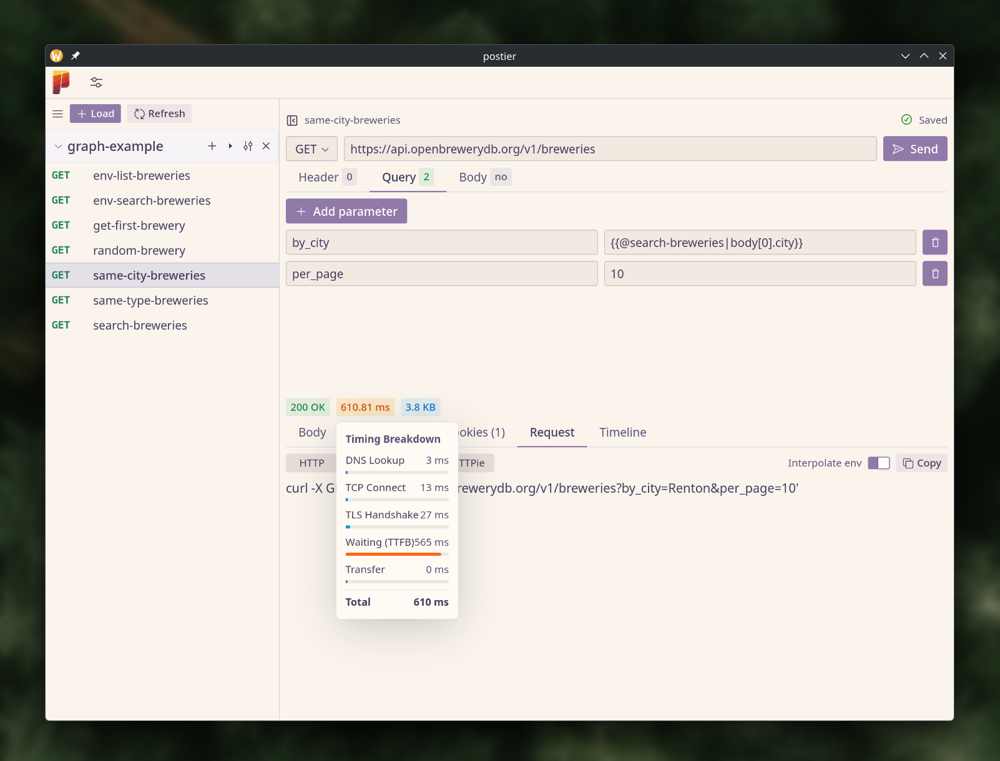

<p align="center">

</p>

<h1 align="center">Postier <i>- a lightweight HTTP client</i></h1>

Postier is a cross-platform HTTP client built with Wails, designed to be a feature-light, no-bullshit alternative to Postman and equivalents.

Fully open-source, no account required, privacy respectful.

## Story

I'm just tired of "free" software that ships a shitload of features nobody asked for, forces a mandatory user account and comes with a creepy privacy statement.

So I built a tool that does only what it says and nothing more — and made it open-source.

I know this kind of app implies a lot of features eventually (GraphQL, WebSocket, etc.) but this is a cool adventure, so let's go :)

You can join by contributing or via a [tip](https://github.com/sponsors/bouteillerAlan).

## Features

Anything you expect from this kind of tool plus:
 - chained request
 - variables injection
 - plain file collection (git ready)
 - built-in theme and user made theme
 - "run all" feature with dependencies graph
 - timing breakdown per phase (DNS, TCP, TLS, TTFB, Transfer) with redirect indicators directly via the go backend

See [`graph-example/`](graph-example/) for a ready-to-load demo using the Open Brewery DB API!

<p align="center">

</p>

## Getting Started

### Documentation

[Check here](https://postier.a2n.dev/docs.html)

### Prerequisites

- [Go 1.23+](https://go.dev/dl/)
- [Node.js](https://nodejs.org/) with npm
- [Wails CLI](https://wails.io/docs/gettingstarted/installation) — `go install github.com/wailsapp/wails/v2/cmd/wails@latest`

### Local Development

1. Install frontend dependencies:
```bash
npm install --prefix frontend
```

2. Start the dev server:
```bash
wails dev
```

### Build

```bash
wails build
```

Packages for Linux (`.deb`, `.rpm`, `.apk`), Windows (`.exe` installer) and macOS (`.dmg`) are produced by the CI pipeline.

If you're running into some issues with Webkit, try running:

```bash
wails dev -tags webkit2_41
```

**Sidenote**

ATM github action build package for webkit2gtk 4.0 so I build the one for webkit2gtk 4.1 manually.

## Contributing

Contributions are welcome. Please feel free to open an issue or submit a pull request.

## Code of conduct, license, authors, changelog, contributing

See the following files:
- [code of conduct](CODE_OF_CONDUCT.md)
- [license](LICENSE)
- [contributing](CONTRIBUTING.md)
- [security](SECURITY.md)

## Want to support my work?

- [GitHub Sponsors](https://github.com/sponsors/bouteillerAlan) or [Ko-fi](https://ko-fi.com/a2n00)
- Give a star on GitHub
- Or just participate in the development :D

### Thanks!
