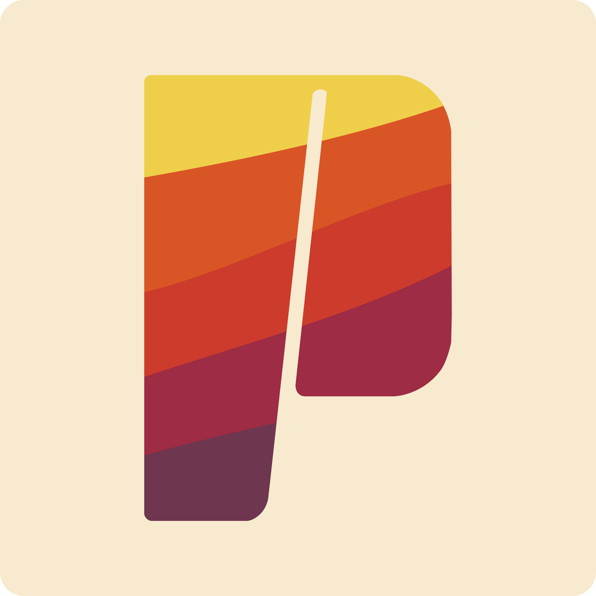

[](https://github.com/bouteillerAlan/postier/actions/workflows/release.yml)

<p align="center">

</p>

<h1 align="center">Postier <i>- a lightweight HTTP client</i></h1>

Postier is a cross-platform HTTP client built with Wails (Go + React), designed to be a feature-light, no-bullshit alternative to Postman and equivalents.

Fully open-source, no account required, privacy respectful.

## Story

I'm just tired of "free" software that ships a shitload of features nobody asked for, forces a mandatory user account and comes with a creepy privacy statement.

So I built a tool that does only what it says and nothing more — and made it open-source.

I know this kind of app implies a lot of features eventually (GraphQL, WebSocket, etc.) but this is a cool adventure, so let's go :)

You can join by contributing or via a [tip](https://github.com/sponsors/bouteillerAlan).

## Features

- **HTTP Request Support**
  - GET, POST, PUT, DELETE, PATCH, HEAD and OPTIONS methods
  - URL input with method selector
  - Request body editor (JSON, Text, XML, SPARQL, or none)
  - Headers management
  - Query parameters management
  - Auto-save on send (togglable)

- **File Collections**
  - Import one or more local folders as collections
  - Requests are saved as `.postier` files, organized the way you like
  - Tree view of all your collections with folder and file navigation
  - Rename, delete and create files/folders directly from the sidebar
  - Currently open file is highlighted in the tree

- **Response Handling**
  - Status code, response time and size at a glance
  - Response body viewer
  - Response headers viewer
  - Cookies viewer

- **User Interface**
  - Clean design built on Radix UI
  - Built-in themes: Catppuccin (Mocha, Macchiato, Frappé, Latte) and Rosé Pine (Main, Moon, Dawn)
  - Custom themes: drop a JSON file in a local folder, reload without restarting — [see docs/themes.md](docs/themes.md)
  - Persistent state across restarts (collections, open file, settings)

## Roadmap

[https://github.com/users/bouteillerAlan/projects/4/views/2](https://github.com/users/bouteillerAlan/projects/4/views/2)

## Tech Stack

| Layer | Technology |
|---|---|
| Desktop framework | [Wails v2](https://wails.io) |
| Backend | Go 1.23 |
| Frontend | React 18 + TypeScript |
| UI components | Radix UI / Radix Themes |
| State management | Zustand |
| Bundler | Vite |

## Getting Started

### Prerequisites

- [Go 1.23+](https://go.dev/dl/)
- [Node.js](https://nodejs.org/) with npm
- [Wails CLI](https://wails.io/docs/gettingstarted/installation) — `go install github.com/wailsapp/wails/v2/cmd/wails@latest`

### Local Development

1. Install frontend dependencies:
```bash
npm install --prefix frontend
```

2. Start the dev server:
```bash
wails dev
```

### Build

```bash
wails build
```

Packages for Linux (`.deb`, `.rpm`, `.apk`), Windows (`.exe` installer) and macOS (`.dmg`) are produced by the CI pipeline.

## Contributing

Contributions are welcome. Please feel free to open an issue or submit a pull request.

## Code of conduct, license, authors, changelog, contributing

See the following files:
- [code of conduct](CODE_OF_CONDUCT.md)
- [license](LICENSE)
- [authors](AUTHORS)
- [contributing](CONTRIBUTING.md)
- [changelog](CHANGELOG)
- [security](SECURITY.md)

## Want to support my work?

- [GitHub Sponsors](https://github.com/sponsors/bouteillerAlan) or [Ko-fi](https://ko-fi.com/a2n00)
- Give a star on GitHub
- Or just participate in the development :D

### Thanks!
